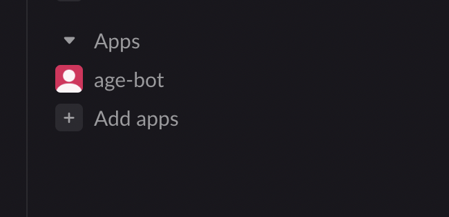
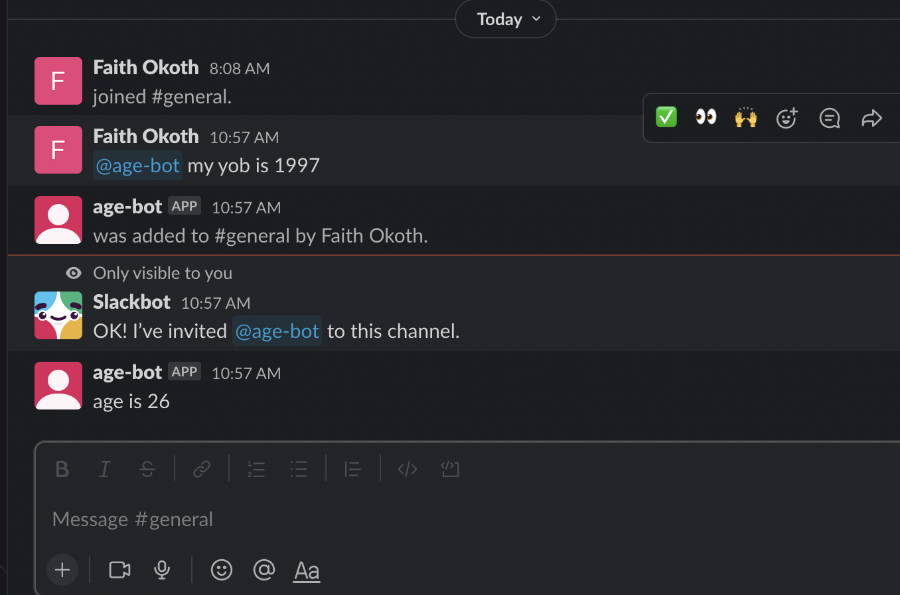
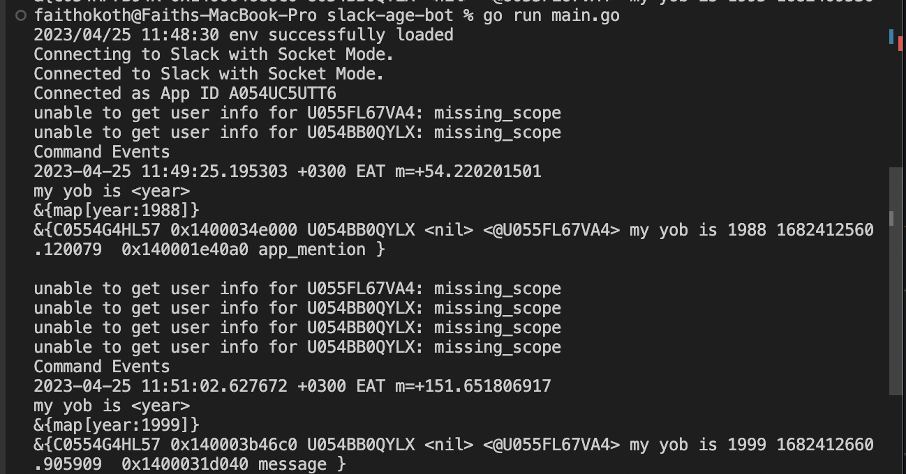

# Slack-age-bot
This is a slack bot that caculates the age of user when the user inputs their year of birth

## Requirements:
To launch and run this bot, you need:
1. a slack workspace in which you are admin
2. slack api keys and tokens
3. Go installed

# Installation
1. **Step 1 (slack website)**
*  go to the [slack api website](https://api.slack.com/apps/) and create a new app. Ensure you select the app from scratch as it will allow you to manually get configurations.
*  Enable [socket mode](https://app.slack.com/app-settings/T054RSZRBS6/A054UC5UTT6/socket-mode). this will generate the app bot token that will allow you to connect to the bot. 
* Enable [events](https://api.slack.com/apps/A054UC5UTT6/event-subscriptions). This will ensure your app is notified of events on slack. For this particular bot, ensure you subscribe to the following events:
```
\app_mention
\im_history_changed
\message.channels
\message.im
\message.mpim
```
* [navigate the OAuth and permissions](https://api.slack.com/apps/A054UC5UTT6/oauth?). This section will provide you with the slack application token and also give you the opportunitity to define permissions for your bot.

For this particular bot, ensure you give the following permissions: 
```bash 
\app_mentions:read
\calls:read
\calls:write
\channels:history
\channels:manage
\channels:read
\chat:write
\chat:write.public
\im:history
\im:read
\im:write
\mpim:history
\mpim:read
\mpim:write

```

2. App installation
to install the bot, simply type this command:
```go
go get "gitnub.com/Faith-qa/Learning_go/slack-age-bot"
```
doing so will install all the packages

copy the `env_sample` file into a `.env` file to configure the enviroment variables.

```bash
cp env_sample .env
```
ensure you input the correct keys in the .env files. If you change the key names, kindly update the `main.go` file with the new key names.

## Running the Application
To run the bot simply use this command:
```go
go run main.go
```

you should be able to see the bot in your slack as follows. feel free to test it out.

**bot available in slack**




**bot at work**




**you can always access the logs from your terminal**




<!-- CONTRIBUTING -->
## Contributing

Contributions are what make the open source community such an amazing place to learn, inspire, and create. Any contributions you make are **greatly appreciated**.

If you have a suggestion that would make this better, please fork the repo and create a pull request. You can also simply open an issue with the tag "enhancement".
Don't forget to give the project a star! Thanks again!

1. Fork the Project
2. Create your Feature Branch (`git checkout -b feature/AmazingFeature`)
3. Commit your Changes (`git commit -m 'Add some AmazingFeature'`)
4. Push to the Branch (`git push origin feature/AmazingFeature`)
5. Open a Pull Request


